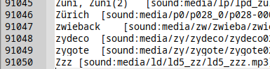

# LDOCE5 extraction and Anki deck builder

This is an ultimate tool to build an ultra massive anki deck from LDOCE5.

Japanese edition:
  https://www.amazon.co.jp/%E3%83%AD%E3%83%B3%E3%82%B0%E3%83%9E%E3%83%B3%E7%8F%BE%E4%BB%A3%E8%8B%B1%E8%8B%B1%E8%BE%9E%E5%85%B8-5%E8%A8%82%E7%89%88-DVD-ROM%E4%BB%98/dp/4342100940

This software extracts all text, image files and MP3 files, then creates **anki.html** for you to import them into Anki, which is separated by TABs.

In addition, it merges audio files into one when a page has a multiple of them so as to avail the Anki's autoplay facility.

As for the DVD-ROM, I tested against the Japanese one published by Pearson alone and the extraction finished successfully.


In order to open media files with Anki, you need to move the **media** directory that this application generated under Anki's collection.media.

**!! You shouldn't try to open the html file with a browser. It breaks the window !!**


They are the screen captures of what you see when the anki file building has been completed. There are 91k mini entries, and its file size sums up to about 100 MB.

<br>

When you import these entries into your Anki, don't forget to select the "Import even if existing note has same first field" option. Data has **5 fields**.


**Download**
 - https://github.com/growingspaghetti/ldoce5-extraction-and-anki-deck-builder/releases/

---

このソフトはLDOCE5のDVDデータを抽出し、超巨大なAnki用単語帳を作成するソフトです。

桐原書店により出版された書籍で動作を確認しております。例文を含めた全音声をAnki用の単語帳**anki.html**に含めます。区切り文字はタブです。メディアファイルは**media**ディレクトリ以下に抽出されているため、これをAnkiのcollection.mediaディレクトリに配置して下さい。

絶対に超巨大なhtml形式の単語帳を普通のブラウザで表示しようとしないで下さい！画面が固まります！

---

Thanks to the author of https://github.com/ciscorn/ldoce5viewer/blob/master/ldoce5viewer/ldoce5/idmreader.py, the following diagram shows the data structure.


One of the tricky points was that it wasn't the end of the process that I decompressed data by slicing the concatenated content.tda with zlib reader. It became raw, nevertheless the resulting chunk was also in the form of concatenated files. To slice it into proper files with paths, it was required to seek the segmentation info alongside with the directory-entry-relation table.

The order of block alignment is straight forward for the fact that it agrees with the one written in config.cft.

```
[DAT]
PATH = files.dat
$TYPE               = UBYTE
$CONTENT = DATA
$CONTENT,OFFSET     = ULONG
$NAME = DATA
$NAME,OFFSET        = U24
$TITLE = DATA
$TITLE,OFFSET       = USHORT
$A_FILE             = USHORT
$TEXTTITLE = DATA
$TEXTTITLE,OFFSET   = USHORT
$A_DIRS             = USHORT
PAGESIZE = 256
```
... The corresponding .dat file has a reading cycle of 1+4+3+2+2+2+2=16 byte-length seeking. The occurence of information is corresponding to this description as well. 

That is,
[[1 byte: type info][4 bytes: file content segment offset][3 bytes: -][2 bytes: -][2 bytes: -][2 bytes: -][2 bytes: pointer to parent directory]]

----


This advanced learner's dictionary doesn't contain a good amount of patterns. For instance, https://idioms.thefreedictionary.com/bruit+about isn't included. At some point, it would be more efficient to use your time with WordNet https://github.com/growingspaghetti/websters-1913-console-dictionary https://dbmx.net/dict/wordnet.tsv, the Farlex idiom dictionary https://www.amazon.co.jp/Farlex-Idioms-Slang-Dictionary-Collection-ebook/dp/B0768WSZ9C, and the Gmail grammar check.


WordNet tsv was compiled by https://github.com/estraier/tkrzw-dict as I already put the link with the `.tsv` extension; and I added a little bit of color flavours in HTML: [wordnettsv.tab.zip](./wordnettsv.tab.zip)


[wntsv.zip](./wntsv.zip) is that in the startdict format.
