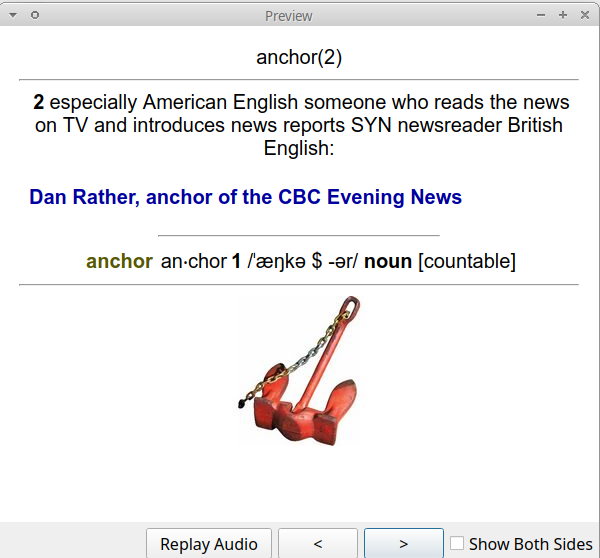

# LDOCE5 extraction and Anki deck compile

This is an ultimate tool to build a ultra massive anki deck from LDOCE5.

Japanese edition:
  https://www.amazon.co.jp/%E3%83%AD%E3%83%B3%E3%82%B0%E3%83%9E%E3%83%B3%E7%8F%BE%E4%BB%A3%E8%8B%B1%E8%8B%B1%E8%BE%9E%E5%85%B8-5%E8%A8%82%E7%89%88-DVD-ROM%E4%BB%98/dp/4342100940

This software extracts all text, image files and MP3 files, then creates **anki.html** for you to import them into Anki, which is separated by TABs.

In addition, it merges audio files into one when a page has a multiple of them so as to avail the Anki's autoplay facility.

As for the DVD-ROM, I tested against the Japanese one publised by Pearson alone and the extraction finished successfully.

In order to open media files with Anki, you need to move the **media** directory that this application generated under Anki's collection.media.

**!!You shouldn't try to open the html file with a browser. It breaks the window!**

---

このソフトはLDOCE5のDVDデータを抽出し、超巨大なAnki用単語帳を作成するソフトです。

桐原書店により出版された書籍で動作を確認しております。例文を含めた全音声をAnki用の単語帳**anki.html**に含めます。区切り文字はタブです。メディアファイルは**media**ディレクトリ以下に抽出されているため、これをAnkiのcollection.mediaディレクトリに配置して下さい。

絶対に超巨大なhtml形式の単語帳を普通のブラウザで表示しようとしないで下さい！画面が固まります！

